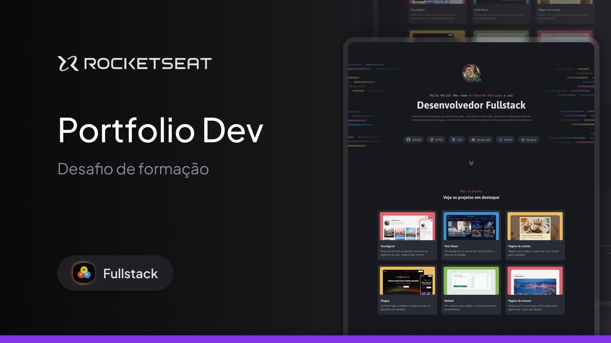

<h1 align="center"> PROJETO Portfolio Dev</h1>

Este foi um desafio prático - Portfólio Dev que a Rocketseat solicitou no curso de FullStack para colocar em prática o conhecimento adquirido ao decorrer dos modulos de HTML e CSS Avançado.

  <a href="#-tecnologias">Tecnologias</a>&nbsp;&nbsp;&nbsp;|&nbsp;&nbsp;&nbsp;
  <a href="#-projeto">Projeto</a>&nbsp;&nbsp;&nbsp;|&nbsp;&nbsp;&nbsp;
  <a href="#-layout">Layout</a>&nbsp;&nbsp;&nbsp;|&nbsp;&nbsp;&nbsp;

 

  

## 🚀 Tecnologias

Esse projeto foi desenvolvido com as seguintes tecnologias:

- HTML e CSS
- Git e Github
- Figma

## 💻 Projeto

Este projeto foi realizado com base nas aulas do Rocketseat no curso de Full-Stack.

## 🔖 Layout

Você pode visualizar o layout do projeto através [DESSE LINK](https://www.figma.com/design/JWqY1s39tj5im5eI85Oyx6/Portfolio-Dev--Community-?node-id=0-1&p=f&t=l4JdZfgo4QBbTuIC-0). É necessário ter conta no [Figma](https://figma.com) para acessá-lo.